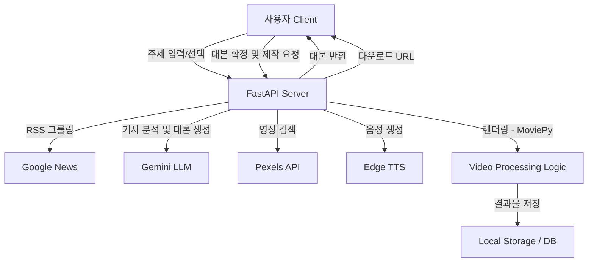

# 🎬 AI Shorts Maker (News-to-Video Automation)

> **최신 뉴스 트렌드 분석부터 대본 작성, 영상 편집까지 100% 자동화한 AI 숏폼 생성 서비스**


---

## 📖 프로젝트 소개 (Project Overview)

**AI Shorts Maker**는 사용자가 주제를 입력하거나 실시간 트렌드를 선택하면, AI가 자동으로 1분 내외의 **숏폼(Shorts) 뉴스 영상**을 제작해주는 웹 애플리케이션입니다.

유튜브 크리에이터들이 뉴스 소싱, 대본 작성, 영상 편집에 많은 시간을 쏟는 문제에 착안하여, **Google News RSS**와 **LLM(Gemini)**, **TTS**, **영상 처리 라이브러리**를 결합해 콘텐츠 제작 시간을 획기적으로 단축(약 5분 이내)하는 것을 목표로 개발했습니다.

### 🎯 주요 기능
1.  **실시간 트렌드 분석**: Google News RSS를 크롤링하여 현재 대한민국에서 가장 이슈가 되는 키워드 5가지를 실시간으로 추천합니다.
2.  **AI 페르소나 시스템 (Dual Persona)**: 
    * **편집장(Editor)**: 수집된 뉴스 기사 10건을 분석하여 가장 중요한 '메인 토픽'을 선정하고 팩트를 검증합니다.
    * **작가(Writer)**: 선정된 팩트를 바탕으로 시청 지속 시간을 늘리는 '후킹(Hooking)' 멘트가 포함된 대본을 작성합니다.
3.  **Human-in-the-loop**: AI가 작성한 대본을 사용자가 직접 수정하고 확정할 수 있는 에디터 인터페이스를 제공하여 결과물의 품질을 보장합니다.
4.  **원클릭 영상 렌더링 시스템**:
    * 주제에 맞는 무료 스톡 영상(Pexels API)을 자동으로 검색 및 다운로드합니다.
    * Edge-TTS를 활용하여 자연스러운 한국어 음성(여성/남성)을 생성합니다.
    * **MoviePy**를 활용해 자막 합성, 오디오 싱크 조절, 배경 음악 삽입 등 복잡한 편집 과정을 자동화합니다.

---

## 🛠 기술 스택 (Tech Stack)

### Backend
* **Framework**: FastAPI (비동기 처리에 최적화된 고성능 프레임워크)
* **Language**: Python
* **AI/LLM**: Google Gemini-2.5-flash (빠른 응답 속도와 최신 정보 처리 능력 활용)
* **Media Processing**: 
    * `MoviePy`: 영상 병합, 오디오 합성 및 인코딩
    * `Pillow (PIL)`: 자막 이미지 동적 생성 (텍스트 줄바꿈 및 중앙 정렬 계산)
    * `edge-tts`: MS Edge의 자연스러운 무료 TTS 엔진 활용
* **Database**: MySQL (SQLAlchemy ORM 사용)
* **Crawling**: `feedparser` (RSS 데이터 파싱)

### Frontend
* **Library**: React (Vite 빌드 도구)
* **State Management**: useState (직관적인 상태 관리)
* **Communication**: Fetch API (RESTful 통신)
* **Styling**: CSS Modules (반응형 디자인 적용)

---

## 🏗 시스템 아키텍처 (System Architecture)



📂 폴더 구조 (Directory Structure)
```Bash

📦 AI-Shorts-Maker
├── 📂 frontend          # React UI 애플리케이션
│   ├── src/App.jsx      # 메인 UI 및 상태 관리 로직
│   └── ...
├── 📂 backend           # FastAPI 서버 애플리케이션
│   ├── main.py          # API 엔트리포인트 & 비동기 스레드 관리
│   ├── services.py      # 외부 서비스 연동 (Gemini, RSS, TTS)
│   ├── video_engine.py  # 영상 처리 엔진 (MoviePy, Pillow 자막 처리)
│   ├── models.py        # 데이터베이스 스키마 정의
│   ├── database.py      # DB 세션 설정
│   └── results/         # 생성된 영상 결과물 저장소
└── README.md
